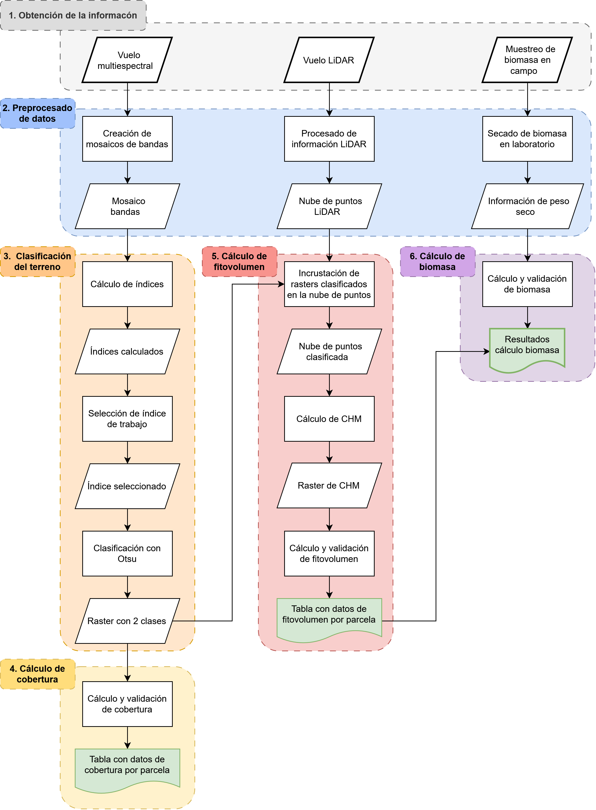

Este repositorio almacena el código utilizado para el Trabajo Fin de Master titulado "Monitorización multitemporal de la carga de combustible en pastizales del sureste de la península ibérica mediante teledetección con UAV" escrito en el ámbito del Máster Oficial en Geomática, Teledetección y modelos Espaciales aplicados a la Gestión Forestal.

En el directorio _modulos_ están los módulos desarrollados para cargar y servir de apoyo a los scripts principales.

Los scripts principales están estructurados en orden para seguir el flujo de trabajo del TFM.

